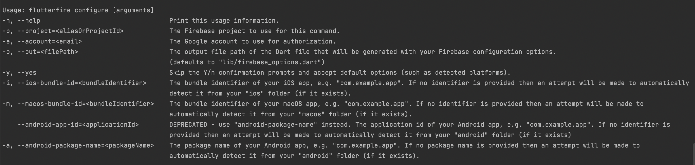

# mvvm_architecture

A base Flutter application with mvvm architecture

## FVM Installation

https://fvm.app/docs/getting_started/installation

## Getting Started

- Flutter version using : 3.0.0 (stable at 11/5/2022)
- Dart version using : 2.17.0
- DevTools version using : 2.12.2
- Platform android : 31, Build-tools : 30.0.2
- Java version OpenJDK 11.0.11+9
- Gradle version 7.2
- Build:gradle version: 7.1.3
- Kotlin version: 1.6.21

### Configure Firebase Multi Flavor

Step 1 : Install Firebase CLI with npm : "npm install -g firebase-tools"

https://firebase.google.com/docs/cli#install-cli-mac-linux

Step 2 : Login to firebase account : "firebase login"

Step 3 : Install FlutterFire CLI with this command : "dart pub global activate flutterfire_cli"

Step 4 : Configure multi flavor with: 

Run command "flutterfire configure -i packageName -a packageName -o lib/firebase/firebase_options_{flavor}.dart" for each flavor.

Dev: "flutterfire configure -i com.vmo.c3FlutterTemp.dev -a com.vmo.c3FlutterTemp.dev -o lib/firebase/firebase_options_dev.dart"

Staging: "flutterfire configure -i com.vmo.c3FlutterTemp.staging -a com.vmo.c3FlutterTemp.staging -o lib/firebase/firebase_options_staging.dart"

Production: "flutterfire configure -i com.vmo.c3FlutterTemp -a com.vmo.c3FlutterTemp -o lib/firebase/firebase_options.dart"

Other configure: 


Documentation at : https://firebase.google.com/docs/flutter/setup?platform=ios

### Configuration Environment Running

- ANDROID STUDIO Step 1 : Open " Run => Edit Configuration in Android Studio"

Step 2 : Create new Configuration with build flavor value is :

+ Develop Environment : dev
+ Staging Environment : staging
+ Production Environment : production

### Command need to run before run app

- Please run script ".setup_app.sh" in terminal (On MacOS if can't run this script please try "sh
  .setup_app.sh")

### Build APK

- flutter build apk --flavor {flavorOnStep2}

### Build IPA without archive on Xcode

- flutter build ipa --flavor {flavorOnStep2} --export-options-plist=ios/Runner/ExportOptions.plist

### Project architecture (MVVM Architecture)

## Why 

- Because clean architecture not a best choice for small app and CRUD app. I decide to separate to mvvm architecture reduce 
  boilerplate code, easy to implement and easy to test.

## What

1. UI - Repository.
2. UI layer consist of

* Widgets : View
* BLoC : View Model
    * Bloc only manages UI state based on business logic

3. Repository layer consist of

* Common : Contain models using in most file at repository folder
* Login (Feature name)
    * models : Contain all models of this feature
        * request
        * response
        * entity (Optional when you want to reduce field to return to UI from response)
    * login_api.dart class : API class generate from retrofit
    * login_repository.dart class : Handle calling API, storage data from API, return response or
      entity to UI
    * login.dart : class using to export all file in login folder, using for only one import

## Project Structure

```
project
|--.fvm                                              # fvm config using for project
|   |--fvm_config.json                               # config file
|--android                                           # android project dir
|--assets                                            # application all assets
|   |--images                                        # application image assets
|   |--fonts                                         # application font assets
|--ios                                               # ios dir
|--lib                                               # main project dart lib entry point
|   |--config                                        # configuration for project
|   |   |--app_config.dart                           # config enum flavor and baseURL (development, staging, production)
|   |   |--colors.dart                               # config for color
|   |   |--navigation_util.dart                      # config navigation key and nested navigation key
|   |   |--styles.dart                               # config for text styles
|   |   |--theme.dart                                # config for theme for project
|   |--core                                          # core project include string extension, int extension, double extension,... 
|   |   |--string.dart                               # string extension function
|   |   |--double.dart                               # double extension function
|   |--firebase                                      # firebase config that auto generated by Firebase CLI
|   |--repositories                                  # repositories layer for mvvm architecture 
|   |   |--login                                     # login feature folder
|   |   |   |--models                                # login model request and response folder 
|   |   |   |--login.dart                            # export file for import in other place
|   |   |   |--login_api.dart                        # api abstract class on retrofit
|   |   |   |--login_api.g.dart                      # api generate class on retrofit
|   |   |   |--login_repository.dart                 # repository class for login feature
|   |   |--utils                                     # utils for data layer
|   |   |   |--exceptions                            # custom exception for repository layer
|   |   |   |--share_pref_manager.dart               # Share preferences manager class (include share preferences key enum)
|   |--ui                                            # ui layer for mvvm architecture 
|   |   |--common                                    # common widget or common screen
|   |   |--login                                     # login ui layer
|   |   |   |--bloc                                  # login bloc for whole login screen
|   |   |   |--ui                                    # ui folder for login feature
|   |   |   |   |--login_screen.dart                 # login ui frame
|   |   |   |   |--widgets                           # widgets folder for nested widget in login feature
|   |   |   |--login_route.dart                      # login route class define BlocProvider for Bloc class of login feature
|   |--utils                                         # utility folder for project
|   |   |--di                                        # dependencies injection registration for project
|   |   |--multi-languages                           # localization for project, using easy_localization and google sheet generator csv
|   |   |--route                                     # route config for project, include generateRoute and route define all screen of project
|   |   |--session_utils.dart                        # session utility for project like getAccessToken or something using common most
|   |--main.dart                                     # main config Material App and runApp
|--test                                              # unit test
|--web
|--.gitignore                                        # ignore file of git
|--fastlane                                          # config ci/cd using fastlane
|--README.md                                         # ReadMe for this project
|--analysis_options.yaml                             # lint rule configuration, config rule here
|--.gitlab-ci.yml                                    # config ci/cd for gitlab
|--pubspec.yaml                                      # dart package management file, add new dependencies here
|--.setup_app.sh                                     # Script to set up app before run app
|--.setup_env_config.sh                              # Script to set up environment variable to display on ci/cd
|--.setup_fastlane.sh                                # Script to set up fastlane config before run ci/cd
|--..build_android.sh                                # Script to build android on local

```

## Injections

1. We are using [get_it](https://pub.dev/packages/get_it) for injections. It is fun because we can
   start the service locator and use it everywhere when needed because they are injected at
   top-level in main.dart.
2. Only use it upon initialization

```
getIt.registerSingleton<LoginBloc>(LoginBloc(
    loginUseCase: LoginUseCase(getIt<LoginRepositoryImpl>()),
  ));
```

and use it on `route`

```
BlocProvider<LoginBloc>(
    create: (_) => getIt.get<LoginBloc>(),
),
```

for reusing the `BLoC`,

```
BlocProvider.value(
    value: getIt.get<PumpsBloc>(),
)
```

for usage (in Widgets), **always** use

`context.boc<PumpsBloc>().add(AddPumps());`

instead of

`getIt.get<PumpsBloc>().add(AppPumps());`

For non widget usage, manually inject the object on initialization.

### Localization

We are using [Easy Localization](https://pub.dev/packages/easy_localization) to handle
multi-languages. 
Using [Google Sheet Generator](https://github.com/Hoang-Nguyenn/easy_localization_generator) on
cloud will take less effort for change and update key and value. Only need update in google sheet
file. (Using only one way, csv or json)

Google sheet sample on this project :
"https://docs.google.com/spreadsheets/d/1SpiJWFRfJaIRnzpEc0mJ2WaaI9JYlz8jKBPduAPzdXE/edit#gid=1013756643"

Step to set-up google sheet :

- 1 : Create a CSV Google Sheet with form like that form
  "https://docs.google.com/spreadsheets/d/1SpiJWFRfJaIRnzpEc0mJ2WaaI9JYlz8jKBPduAPzdXE/edit#gid=1013756643"
- 2 : Enable share for anyone have this link
- 3 : on file locale_keys.dart in lib/utils/multi-languages/locale_keys.dart change docId annotation
  with your google sheet docid Example of DocID is :
  "https://docs.google.com/spreadsheets/d/1SpiJWFRfJaIRnzpEc0mJ2WaaI9JYlz8jKBPduAPzdXE (it's docId)
  /edit#gid=1013756643"
- 4 : run terminal : "flutter pub run build_runner build" to generate .g.dart localization file
- 5 : When update new value on google sheet should update plus one version on SheetLocalization at
  locale_keys.dart and run "flutter packages pub run build_runner build" again to get new file csv

Step to setup json file in project :

- 1 : Add key and value in json file at assets/translations/
- 2 : Run command: "flutter pub run easy_localization:generate -S assets/translations -f keys -O lib/utils/multi-languages" for generate .g file
- 3 : Uncomment "// export 'codegen_loader.g.dart';" in file "multi_languages_utils.dart" and comment "export 'locale_keys.dart';"

Step to use multi-languages import in code:

- Remember import file "multi_languages_utils.dart" instead of "locale_keys.dart" because first file
  already import library easy_localization extension,you no need to use 2 import

- Using : LocaleKeys.keyDefine.tr()  (tr() is using to change languages with current languages
  setup, remember have it)

Link library : https://pub.dev/packages/easy_localization
Link plugin generate csv from google
sheet : https://github.com/Hoang-Nguyenn/easy_localization_generator

### Json parsing / serialization

This project is implementing [json_serializable](https://pub.dev/packages/json_serializable). It use
build_runner to generate files. If you make a change to these files, you need to re-run the
generator using build_runner:

```
flutter pub run build_runner build
```

generator using build_runner and remove conflict file :

```
flutter pub run build_runner build --delete-conflicting-outputs
```

### Dio Interceptor

- This project using [pretty_dio_logger](https://pub.dev/packages/pretty_dio_logger) for display log
  in console and [alice](https://pub.dev/packages/alice) inspector http request in UI for debugging.

# Assets

- Image is handled by [flutter_gen](https://pub.dev/packages/flutter_gen) for auto-complete and not
  have to deal with typing mistakes.
- To setup flutter_gen, run `dart pub global activate flutter_gen`

## Adding new Assets

- Add asset(s) into `assets/<asset types>`
- Run `flutter pub run build_runner build` in console
- New image(s) will appear in `lib/gen/assets`

## Remove Asset(s)

- Delete assets from `assets/<asset types>`
- Run `flutter pub run build_runner build` in console
- `lib/gen/assets` will be updated with currently available assets.

## How to change version number and version code :

- Go to pubspec.yaml => line version to change :
- Example : 1.0.10+3 => Version name : 1.0.10, Version code : 3

## Step to change package name

- We using library [change_app_package_name](https://pub.dev/packages/change_app_package_name) for
  easy and fast to change all package name on android and IOS
- Using terminal : flutter pub run change_app_package_name:main "newPackageName"
- Example : flutter pub run change_app_package_name:main com.hoangnh.flutter_temp
  
## Using fastlane

- Require JAVAHOME (JDK 11 https://www.oracle.com/java/technologies/downloads/#java11-mac)
- Install Ruby (https://docs.fastlane.tools/)
- run script .setup_fastlane.sh (First time run)
- bundle exec fastlane android buildAndroid --env dev (Development environment)
- bundle exec fastlane android distribute --env dev (Development environment Distribute)
- bundle exec fastlane ios buildIOS --env dev (Development environment)
- bundle exec fastlane ios getProvision --env dev (Get provision development environment)
